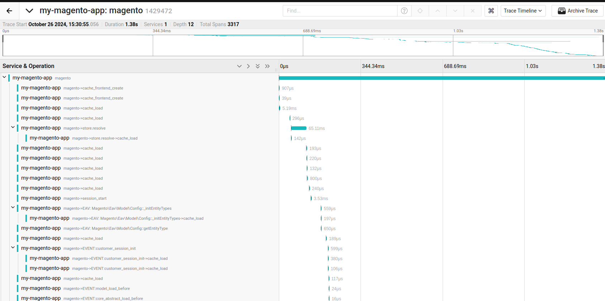
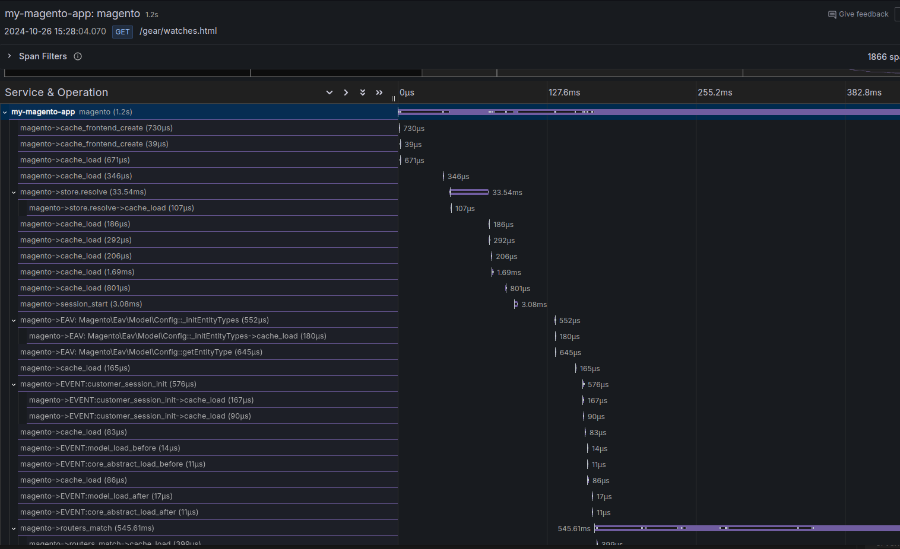

# OpenTelemetry Tracing for Magento 2

## Overview

**OpenTelemetry Tracing** is a Magento 2 module that integrates seamlessly with Magento's built-in Profiling functionality to provide advanced tracing capabilities. By adding a custom tracing driver, this module enables detailed performance monitoring and analysis, helping developers optimize their Magento applications effectively and for free.

## Features

- **Enhanced Profiling:** Extends Magento's native profiler with advanced tracing capabilities.
- **Jaeger Compatibility:** Integrates with Jaeger for distributed tracing using the [jonahgeorge/jaeger-client-php](https://github.com/jonahgeorge/jaeger-client-php) library.
- **Grafana Tempo Support:** Compatible with Grafana Tempo through the OpenTelemetry endpoint, allowing for comprehensive monitoring and visualization.
- **Flexible Configuration:** Easily configure tracing settings via JSON files or Magento CLI commands.

## Compatibility

### Jaeger

OpenTelemetry Tracing integrates with [Jaeger](https://www.jaegertracing.io/), a popular open-source distributed tracing system. This integration is powered by the [jonahgeorge/jaeger-client-php](https://github.com/jonahgeorge/jaeger-client-php) library, ensuring reliable and efficient tracing capabilities.

### Grafana Tempo

The module also supports [Grafana Tempo](https://grafana.com/oss/tempo/), enabling users to leverage Grafana's powerful visualization tools through the OpenTelemetry endpoint. This compatibility allows for seamless tracing data collection and analysis within the Grafana ecosystem.

## Installation

1. **Clone the Repository:**

```bash
composer require poespas/opentelemetry-tracing-magento2
```

2. **Enable the Module:**

```bash
bin/magento module:enable Poespas_OpentelemetryTracing
bin/magento setup:upgrade
```

## Configuration

You can configure the tracing driver using a JSON configuration file or via the Magento CLI command.

### Using `var/profiler.flag` File

Create or update the `var/profiler.flag` file in the root of the magento installation with your JSON configuration:

```
{
  "drivers": [
    {
      "type": "\\Poespas\\OpentelemetryTracing\\Profiler\\Driver\\TracingDriver",
      "application_name": "my-magento-app",
      "config": {
        "local_agent": {
          "reporting_host": "127.0.0.1",
          "reporting_port": 14268
        },
        "dispatch_mode": "jaeger_over_binary_http"
      }
    }
  ]
}
```

### Using Magento CLI Command

Alternatively, enable the profiler with a minified JSON configuration using the following command:

```
bin/magento dev:profiler:enable '{"drivers":[{"type":"\\Poespas\\OpentelemetryTracing\\Profiler\\Driver\\TracingDriver","application_name":"my-magento-app","config":{"local_agent":{"reporting_host":"127.0.0.1","reporting_port":14268},"dispatch_mode":"jaeger_over_binary_http"}}]}'
```

## Screenshots

### Jaeger Integration



*Example of tracing data visualized in Jaeger.*

### Grafana Tempo Integration



*Example of tracing data visualized in Grafana Tempo.*

## Inspiration

OpenTelemetry Tracing was inspired by the [sitewards/Magento2-OpenCensus](https://github.com/sitewards/Magento2-OpenCensus) project.

## License

This project is licensed under the MIT License. See the [LICENSE](LICENSE) file for details.

## Contributing

Contributions are welcome! Please open an issue or submit a pull request for any improvements or bug fixes.

## Support

For support and questions, please open an issue on the [GitHub repository](https://github.com/poespas/opentelemetry-tracing-magento2/issues).
